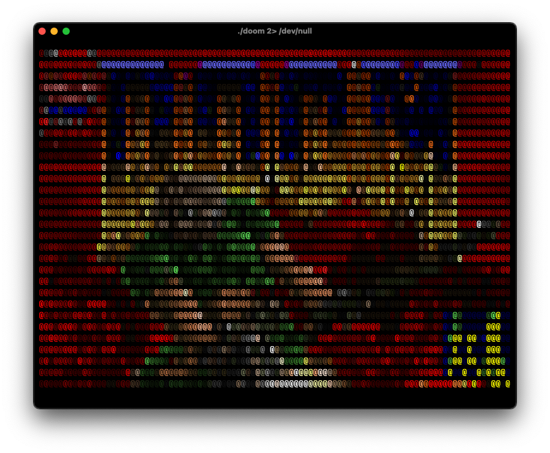
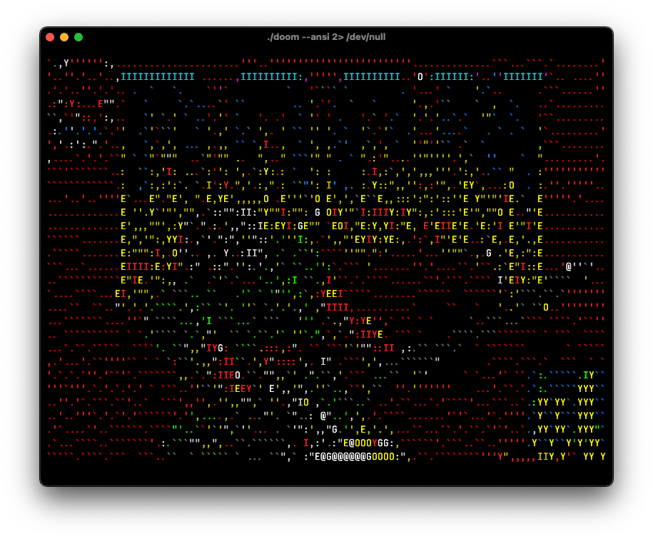
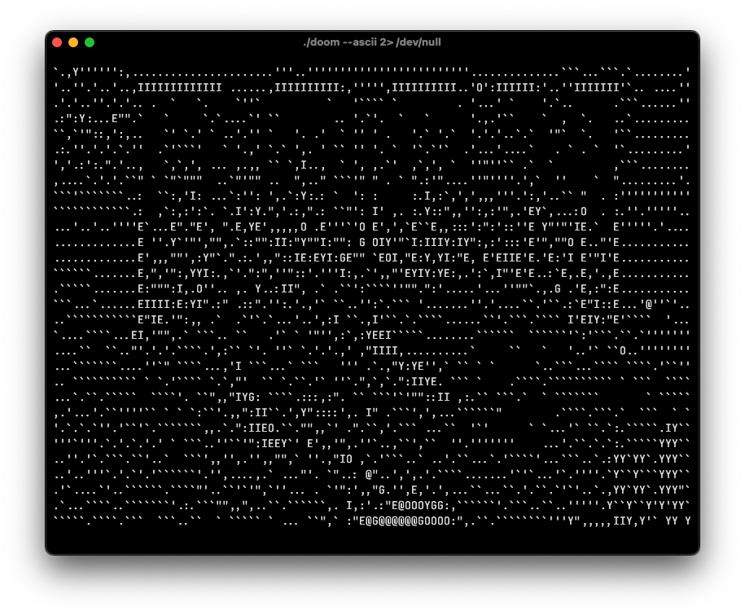

# doom-ncurses

A port of Doom to the terminal using the NCurses library.

The game sends the ncurses output to stdout, and the doom log output to stderr,
so when running the game, stderr may need to be redirected so the output is
rendered correctly.

Any arguments occurring after `--` will be passed directly to doom itself.

```sh
./doom [--ascii|--ansi] -- [-iwad ...] 2> /dev/null
```

## Screenshots

### Default



### `--ansi` option



### `--ascii` option



## Build

To build the project, you'll need both cmake and ncurses installed.

## Acknowledgements

This project is based on a modified version of doomgeneric, the original version
can be found here: https://github.com/ozkl/doomgeneric
